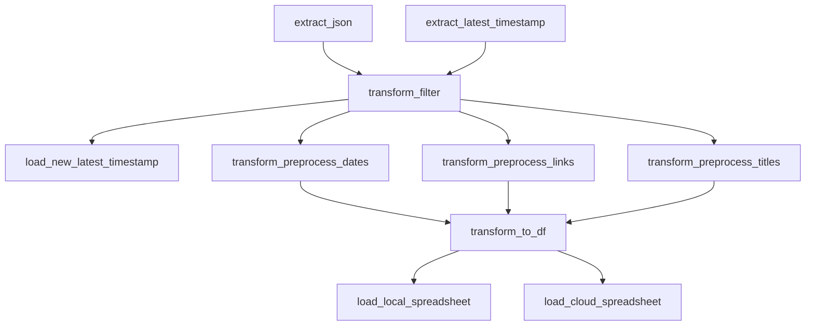
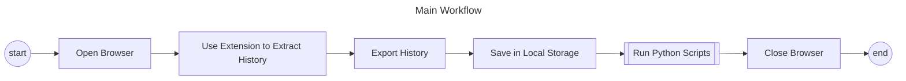
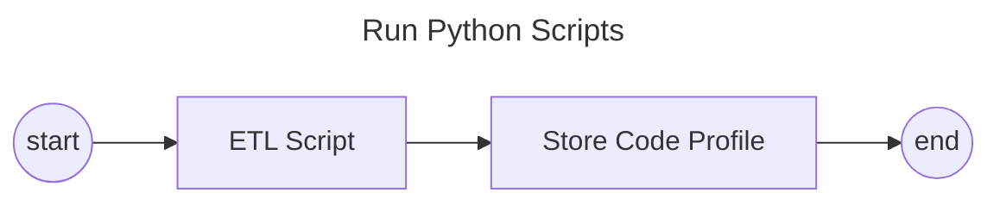

# Browser History
## Checking on my Browser History
|  | Content |
|:------|:--------|
| Description| A data engineering project where  I want to track my browser activity. |
| Field | Data Engineering  | 
| Focus | proper Python styling, automation, proper docstrings  |
| Other focuses | data processing, ETL, data visualization, profiling  |
| Tools used | Python, pandas, numpy, Google Sheets, MS Excel, Looker, MS Power Automate |
| Important links | [Extension - History Export](https://chromewebstore.google.com/detail/history-export/lpmoaclacdaofhlijejogfldmgkdlglj) <br> [Looker Public Dashboard](https://lookerstudio.google.com/reporting/17bf277b-e2bd-40e6-8cc8-6c71a3b46bf1) <br> [Dashboard Documentation](https://docs.google.com/document/d/1L3kXycmpa1jLr_gsKUGYXh29kw5AQnP__lor9ll1a6w/edit?usp=sharing)|
## File Structure
```
Browser History-
├── data/
|   ├── preprocessed/
|   |   ├── browser_history_local_data.csv
|   |   L── z_{latest_timestamp}.csv
|   |
|   ├── raw/
|   |   ├── latest_timestamp.txt
|   |   L── z_{latest_timesstamp}.txt
|   
├── documents/
|   L── requirements.txt
|
├── scripts/
|   ├── etl/
|   |   L── etl.py
|   |
|   qa/
|   ├── profile_reader.py
|   ├── style_checker.py
|   |
|   L── main
|
L── README.md
```
## Pipeline

## Automation Workflow


