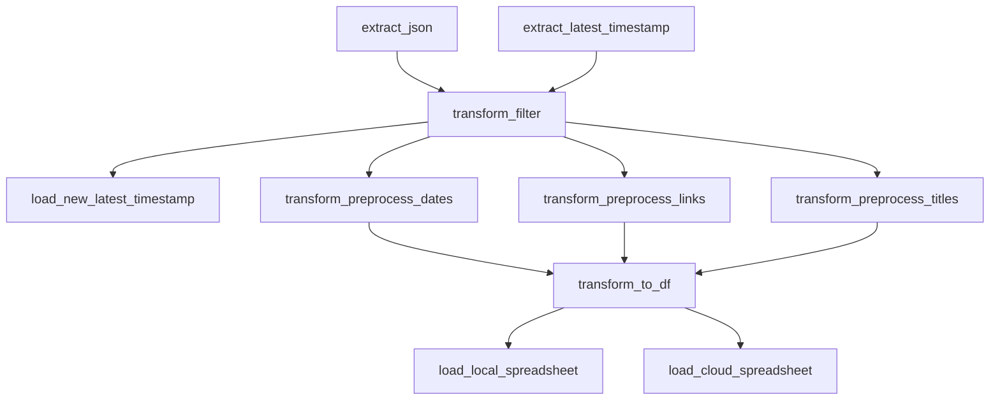

# Browser History
## Checking for my Browser History
| Field | Content |
|:------|:--------|
| Description| Tracking my browser history 
| Field | Data Engineering  | 
| Focus | proper styling, automation, proper docstrings  |
| Other focuses | data processing, ETL, data visualization, profiling  |
| Tools used | Python, pandas, numpy, Google Sheets, MS Excel, Looker, MS Power Automate |
## Pipeline

