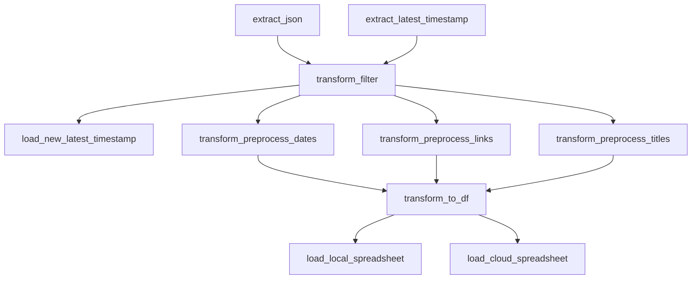

# Browser History
## Checking for my Browser History
**Description**:  
**Field**: Data Engineering  
**Focus**: code documentation and profiling  
**Other focuses**: unit tests, data processing, ETL, data visualization, proper styling  
**Tools used**: Python, pytest, pandas, numpy, Google Sheets, MS Excel, Looker, MS Power Automate
## Pipeline

