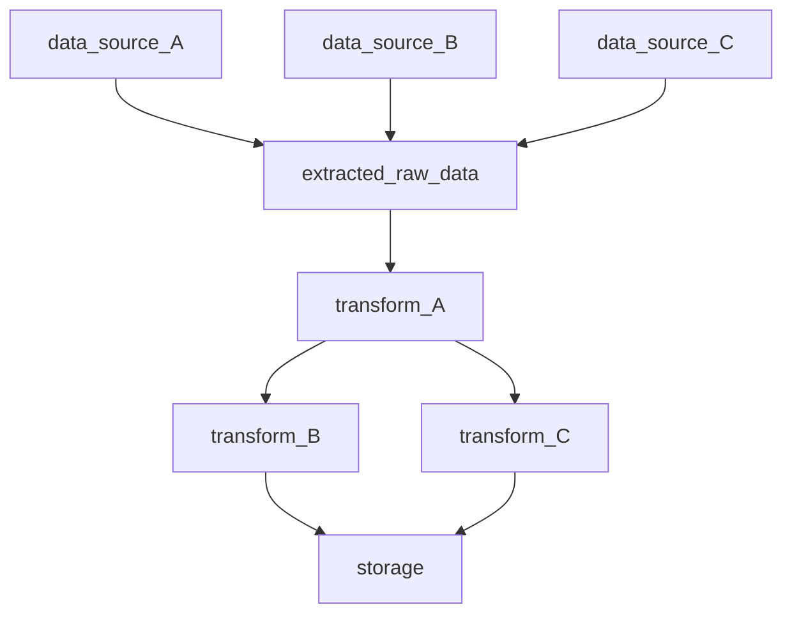

# Data Engineering
## A repository to document my knowledge
### Background
Hello there! This is my data engineering repository where I will apply all that I've learned about data engineering. The topics are making an ETL pipeline, data modeling, error handling, code standards, logging, unit testing, and other concepts that may be related to data engineering. Also, this is where I will generally document my progress on learning and applying data engineering concepts.

Additionally, this repository will contain two main directories: Learning Projects and Projects. **Learning Projects** will contain my short projects that I aim to apply concepts and knowledge that I learned. These projects will most probably take me about 1-2 weeks to do. **Projects** on the other hand will contain multiple concepts and knowledge that I have gained from Learning Projects. These will take me about 1-2 months to finish.

### How can this repository help you
Possibly, you can see how I do or set the following:
- standardizing Python scripts and SQL queries
- data modeling
- create an ETL pipeline
- apply unit tests on a pipeline
### How can you help
- provide feedback on things that you think that needs improvement
## Table of Contents
The information for each content shows my standards for each project that I will make, with execption to very first project. <br>
[General File Structure](https://github.com/Dixboi/Data-Engineering?tab=readme-ov-file#general-file-structure) <br>
[General Data Model](https://github.com/Dixboi/Data-Engineering?tab=readme-ov-file#general-data-model) <br>
[General Pipeline](https://github.com/Dixboi/Data-Engineering?tab=readme-ov-file#general-pipeline) <br>
[Python Scripts Standards](https://github.com/Dixboi/Data-Engineering?tab=readme-ov-file#python-scripts-standards) <br>
[SQL Queries Standards](https://github.com/Dixboi/Data-Engineering?tab=readme-ov-file#sql-queries-standards) <br>
## General File Structure
```
Project-
├── data/
|   ├── preprocessed/
|   |   ├── preprocessed data A
|   |   L── preprocessed data B
|   |
|   ├── raw/
|   |   ├── raw data A
|   |   L── raw data B
|   |
|   L── test/
|       ├── test data A
|       L── test data B
|
├── documents/
|   ├── data model
|   ├── file structure
|   ├── pipeline
|   L── requirements
|
├── scripts/
|   ├── etl
|   ├── code profiling
|   ├── style checker
|   ├── unit tests
|   L── main
|
L── README.md
```
## General Pipeline

## Python Scripts Standards
### Variable Names and Values
1. Boolean variable names should start with "is_" or "has_".
2. Boolean values should ONLY be "True" and "False" when stored in a database.
3. Date variable names should start with "date_".
4. Date values should be "YYYY-MM-DD"
### Functions
1. Should only do one thing.
2. Must display an example output **if applicable**.
3. Must have docstrings, short explanation if needed, try-except statement, and logging outputs.
```Python

import logging
logging.basicConfig(format='%(levelname)s: %(message)s', level=logging.DEBUG)


def add(number_1, number_2):
    '''
    Add two numbers and return them as float
    ----
    Parameters
    number_1: int/float - the first number
    number_2: int/float - the second number
    ----
    Return
    result: float - the sum of the first and second number in float type
    ----
    Example
    >>> add(4, 5)
    9.0
    '''
    try:
        result = float(number_1 + number_2)
    except Exception as e:  # Catch all kind of errors
        logging.error(f"{e} caught in execution.")
    else:
        logging.info(f"Added {number_1} and {number_2} = {result}")
        return result

```
## SQL Queries Standards
- Should follow the [Modern SQL Style Guide](https://gist.github.com/mattmc3/38a85e6a4ca1093816c08d4815fbebfb)
```SQL

select t1.name
     , t2.value
  from table_one as t1
  left join table_two as t2
    on t1.id = t2.id
 where t1.name like 'E%'
   and t2.value > 100
 order by t1.name

```
# Data Sources to Consider
[News API](https://newsapi.org/pricing) <br>
[Kaggle Finance Dataset](https://www.kaggle.com/datasets/creepycrap/finance-dataset) <br>
[Currency API](https://github.com/fawazahmed0/currency-api) <br>
[Kaggle E-Commerce Data](https://www.kaggle.com/datasets/carrie1/ecommerce-data) <br>
# Sources or Useful Materials
## Courses
1. [Data Engineering Career Track by DataCamp](https://app.datacamp.com/learn/career-tracks/data-engineer)
2. [Introduction to Data Engineering by Datacamp](https://app.datacamp.com/learn/courses/introduction-to-data-engineering)
## Books
## Documentations
1. [Mermaid](https://mermaid.js.org/intro/)
2. [Working with Quotas on Google Sheets](https://cloud.google.com/docs/quota#requesting_higher_quota)
3. [Rate limit on Google Sheets](https://developers.google.com/sheets/api/limits)
## Articles
1. [Modern SQL Style Guide](https://gist.github.com/mattmc3/38a85e6a4ca1093816c08d4815fbebfb)
2. [Automate Google Sheets with Python](https://www.geeksforgeeks.org/how-to-automate-google-sheets-with-python/)
3. [Adding data on Google Sheets using Python](https://blog.finxter.com/how-to-append-data-in-a-google-sheet-with-python/)
## Videos
1. [Uber Data Engineer Interview: Design a Ride Sharing Schema](https://www.youtube.com/watch?v=f7v_1UmkAoM)

